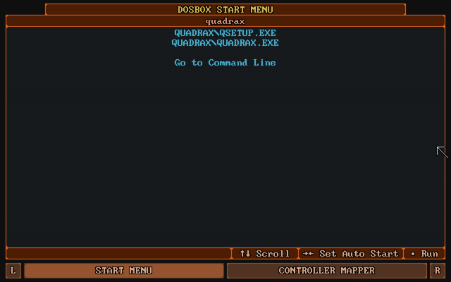
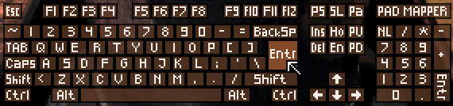
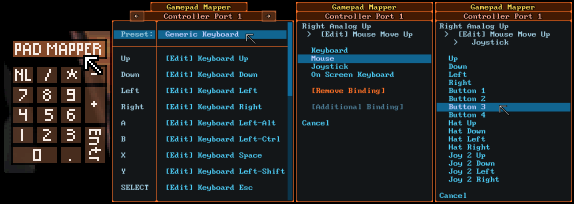

# DOSBox (libretro)

A DOS emulator core for [RetroArch](https://retroarch.com/) and other libretro frontends, built for simplicity and ease of use.

This core is based on [DOSBox Pure](https://github.com/schellingb/dosbox-pure) by Bernhard Schelling, which is itself a fork of [DOSBox](https://www.dosbox.com/). It carries the whole of DOSBox Pure and its history, and adds to it what is described under [Differences from DOSBox Pure](#differences-from-dosbox-pure). Please report problems with this core here, not to the DOSBox Pure project.

It replaces the earlier dosbox-libretro core, which was based on DOSBox 0.74.

## How To Use
In RetroArch, select `Online Updater` -> `Core Downloader` -> `DOS (DOSBox)` where the core is available, or install it manually.

## Manual Install
Locate the directory where your libretro frontend stores its cores. In RetroArch, you can open the main menu and go to `Configuration File` -> `Load Configuration` -> `Parent Directory` -> `cores` to find it.

Copy `dosbox_libretro.dll` (`.so` on Linux, `.dylib` on macOS) into the cores directory, and `dosbox_libretro.info` into the `info` directory, or into `cores` if there is no `info` directory.

## Differences from DOSBox Pure
- **Frontend VFS support**: content and save paths that only the frontend can open, such as Android `content://` URIs, work. See [Frontend Paths](#frontend-paths-android-storage-access-framework).
- **CD audio in FLAC and MP3**: CUE sheets can reference FLAC and MP3 tracks as well as WAV and OGG, decoded with [dr_flac and dr_mp3](https://github.com/mackron/dr_libs) (public domain), so the core still needs no libraries.
- **Pinball scroll hack**: the pinhack patch by Felipe Sanches, as dosbox-core carries it, under `Video > Pinball Scroll Hack`. Pinball games that scroll the table, like Pinball Fantasies, Dreams or Illusions, show the whole table at once. Insert switches it on and off while playing.
- **MT-32 settings**: the MT-32 emulator settings dosbox-core offers are core options under Audio, shown when an MT-32 ROM is the MIDI output: maximum partials, analog output and DAC input emulation, a fixed reverb mode with its time and level, reversed stereo and the nice amp ramp.
- **Core name**: the core is built as `dosbox_libretro` and reports itself as `DOSBox`, so it can be installed next to DOSBox Pure without the two sharing core options or the core info file.
- **Compatible data**: core option keys, `.pure.zip` save files, `#EXT-DOSBOX-PURE-OVERLAY` entries in M3U8 files and the MIDI cache keep their DOSBox Pure names. A game's save file from DOSBox Pure loads in this core once it is in this core's save directory, and playlists and M3U8 files work unchanged.
- **Platforms**: the build for GameCube and Wii targets the right console and uses the toolchain's own threads on Wii U, GameCube, Wii and 3DS. The earlier dosbox-libretro core also built for PSP, PS3, Genode and Emscripten; this core does not.

## Features

### Load Games from ZIP
The core can load games directly from ZIP files without the need to extract them.

### Store Modifications in Separate Save File
Changes made to a loaded ZIP file will be stored as a separate ZIP file into the libretro saves directory.  
If a game is loaded directly without using a container like ZIP or ISO the saves directory is not used.

### Mount Disk Images from Inside ZIP Files
CD images (ISO or CUE) and floppy disk images (IMG/IMA/VHD/JRC) can be mounted directly from inside ZIP files.  
The system will automatically mount the first found disk image as the A: or D: drive.  
Additional disks can be loaded or swapped by using the `Disc Control` menu in RetroArch.  
The start menu also offers the option to mount or unmount an image.

### Start Menu

This is the first screen that appears after loading a game. It offers a gamepad controllable list
with all executable files of the loaded game. In addition it can swap which floppy disk or CD is inserted.

By using the tabs at the bottom, you can view the [Gamepad Mapper](#gamepad-mapper)
and while a game is running access the [On-Screen Keyboard](#on-screen-keyboard).

While a game is running, you can open the menu again by pressing L3 on the retropad (usually by pushing in the left analog stick).

### Auto Start
While in the [start menu](#start-menu), you can press right to set an item as the default which will skip the menu the next time the same content is loaded.
By pressing right multiple times, a number of frames can be specified that will automatically be skipped on start.
This can be used to skip over loading screens or start-up sequences.  
If there is only a single choice, the menu will not show and directly run the only executable file.  
To force the menu to be shown, hold shift on the keyboard or L2 or R2 on
the gamepad while selecting `Restart` in the core menu. You can also always
view the start menu by pressing L on the [On-Screen Keyboard](#on-screen-keyboard).

### On-Screen Keyboard

By pressing L3 on the gamepad (usually by pushing in the left analog stick) the menu will open.
Then you can use the L and R buttons to switch to the On-screen keyboard tab. It is also possible to use the 
`Input > Use L3 Button to Show Menu` option to default to the keyboard when first pressing L3.
The cursor on the On-screen keyboard can be controlled with the controller (or mouse or keyboard)
and L2/R2 will speed up or slow down the cursor speed.  
If the cursor is moved above the middle of the screen, the keyboard will move to the top.
The L3 button can be changed with the [Gamepad mapper](#gamepad-mapper) and there is also a core option to remove it.

### Automated Controller Mappings
When a game is loaded, the core will try to detect the game and apply a controller mapping.  
To see the applied mapping, check Controller Port 1 under the "Controller Mapper" tab of the start menu.
It will show `Mapping: <GAMENAME>`. Additionally you can set the core option
`Input > Advanced > Automatic Game Pad Mappings` to `Enable with notification on game detection`.

### Mouse Emulation
Under the "Controller Mapper" screen in the start menu there are 2 mouse emulation modes available by
switching the `Preset` setting of any port. There is `Mouse with Left Analog Stick` and
`Mouse with Right Analog Stick`.  
When choosing "left stick", the face buttons (B/A) will be used as left/right mouse buttons.  
For the right stick the shoulder buttons L/R will be used as left/right mouse buttons.  
The X button is the middle mouse button and L2/R2 can be used to speed up or slow down mouse movement.  
There is also the core option `Input > Mouse Sensitivity` to increase/decrease mouse movement speed.

The behavior of a real mouse or touch screen can be controlled by the `Input > Mouse Input Mode` option.

- Virtual mouse movement (best used when the frontend [grabs the mouse input](#playing-with-keyboard-and-mouse))
- Direct controlled mouse (not supported by all games)
- Touchpad mode (drag to move, tap to click, etc., best for touch screens)
- Off (ignore mouse/touch inputs)

In Windows 3.x it is possible to use [this driver](https://github.com/NattyNarwhal/vmwmouse) for direct controlled mouse support.

### Keyboard Emulation
For games that don't have automated controller mappings or are not detected successfully the core will map
generic keyboard keys to all buttons. Use the "Controller Mapper" screen in the start menu or the
[On-screen keyboard](#on-screen-keyboard) to freely customize all the mapped buttons.

### Joystick Emulation
There are multiple DOS era joysticks available as mappings under the "Controller Mapper" screen in the start menu.  
`Gravis GamePad (4 Buttons)`, `First 2 Button Joystick` (2 Axes), `Second 2 Button Joystick` (2 Axes),
`ThrustMaster Flight Stick` (3 axes, 4 buttons, 1 hat) and `Both DOS Joysticks` (4 axes, 4 buttons).  
These can be assigned to any port and the button layout can be freely remapped.

### Gamepad Mapper

If you need even more customization of the controls than provided by the [Automated controller mappings](#automated-controller-mappings),
or the various presets for [mouse](#mouse-emulation), [keyboard](#keyboard-emulation) and [joysticks](#joystick-emulation) you can use
the gamepad mapper.

To open it, select "CONTROLLER MAPPER" in the start menu or click the "PAD MAPPER" button in the [On-screen keyboard](#on-screen-keyboard).

It is available any time in-game and changes are immediately saved and applied when closing the mapper. Up to 4 functions can be mapped
for any button/direction of the gamepad. A mapping can be to any function of the 3 emulated input devices: keyboard, mouse or joystick.

The mapping is saved to a DOS file named "C:\PADMAP.DBP" which will be stored in the [save file](#store-modifications-in-separate-save-file) or next to the loaded program (when running without ZIP/DOSZ).

### Installing an Operating System
When loading a content that contains a bootable CD-ROM image, the start menu will show an additional option
`[ Boot and Install New Operating System ]`. Additionally it will also show when both a CD-ROM image and a
floppy disk image are loaded, so non-bootable install CDs can be used as well.

With this option a hard disk image of selectable size (between 8 and 1024 MB) can be created after which
the CD-ROM or floppy disk image will boot to install the operating system. Once the installation has completed,
loading any content (for example a ZIP file) will have the option `[ Run Installed Operating System ]` to boot
the created hard disk image as the C: drive and with the loaded content becoming the D: drive. If there are
any CD-ROM images available they will appear as the E: drive.

There are two core options related to this feature:

- `System > Advanced > OS Disk Modifications`: When running an installed operating system, modifications
  to the C: drive will be made on the disk image by default. Setting it to 'Discard' will never save any
  changes made on C: but allows the content to be closed any time without worry of file system or registry
  corruption. The third option 'Save Difference Per Content' will store any changes made to the C: drive
  into a file in the frontends save directory, but the OS disk image must never be modified
  again once used, otherwise existing differences become unusable.
- `System > Advanced > Force Normal Core in OS`: If you encounter program errors or crashes inside the
  installed operating system, this option can be used to switch to a more compatible but slower
  mode. The option can be toggled on and off as needed.

The operating system will detect a NE2000 networking card which will not be able to connect to the real internet.  
To avoid slow boot times, make sure to configure it to use base address port set to 0x300 and base IRQ set to 10.

In Windows 95 or 98, the keyboard gets detected as "PC/AT Keyboard (84-Key)" which can lead to some issues with arrow
keys and others. To fix it open the "Device Manager", go to the keyboard and run "Update Driver". Then by using
"Display a list of all the drivers" and "Show all hardware" you can find and install the full keyboard driver
"Standard 101/102-Key or Microsoft Natural Keyboard" which is compatible. Make sure to reboot after installing it.

It is also possible to create save states while running an installed operating system. This can be used
to skip the startup sequence or even jump directly to the title screen of a game. Make sure to load the
same operating system and do not modify the loaded ZIP file in any way otherwise the operating system
will be very confused and most likely crash. To make things easier, set the operating system to
[auto start](#auto-start) so it starts together with the content, skipping the start menu.

### 3dfx Voodoo Emulation
The core includes emulation of a 3dfx Voodoo PCI card. Compatible DOS games should work out of the box. If running an
[installed operating system](#installing-an-operating-system) like Windows 95 or Windows 98, you can get the required drivers
from [this site](https://3dfxarchive.com/voodoo1.htm). Download "3dfx Voodoo1 V3.01.00" and launch voodoo1-30100.zip
with the core, then run the operating system and install the driver via the control panel from the files on the D: drive.

There are a few core options related to this feature:

- `Video > 3dfx Voodoo Emulation`: By default a compatible 8 MB memory card with one texture mapping unit is emulated.
  It can be changed to an experimental 12 MB dual TMU card, a 4 MB card or support can be disabled entirely.
- `Video > 3dfx Voodoo Performance Settings`: By default the core will use fast OpenGL hardware acceleration to render 3dfx graphics.
  This setting can be used to switch to software rendering with a more faithful emulation but at much higher CPU cost.
- `Video > 3dfx Voodoo OpenGL Scaling`: Use this setting to increase the render resolution of the OpenGL rendering.

### Multiplayer
The core emulates an IPX DOS driver and a serial modem (configurable to be a null modem or dial-up modem) as well as a
NE2000 network card to be used in a [booted operating system](#installing-an-operating-system). To use it, just host
or connect a multiplayer game with a supported frontend (RetroArch 1.16 and newer).

To use the NE2000 card make sure to configure the Windows 95/98 driver to use base address port set to 0x300 and base IRQ set to 10.

### MIDI Playback with SoundFonts, MT-32 or SC-55
If the core finds one or more `.SF2` sound font files in the `system` directory of the frontend, one of them
can be selected via the `Audio > MIDI Output` core option. This sound font will then be used to play General Midi and Sound Canvas music.

If the `system` directory contains a pair of `_control.rom` and `_pcm.rom` files, an MT-32 synthesizer can be emulated with them.  
Similarily, if it contains a set of `rom1.bin`, `rom2.bin`, `waverom1.bin`, etc. files (with or without a prefix), an SC-55 module can be emulated with them.

Alternatively if the content mounted to the C: drive contains a file named DOSBOX.SF2, MT32_CONTROL.ROM/MT32_PCM.ROM or ROM1.BIN/etc., it will be used as a per-game override to the core option.

### Cheat Support
The core exposes its memory for cheats in the libretro frontend.  
For details how to use it and how to find new cheats while playing the game,
check the [documentation on the RetroArch website](https://docs.libretro.com/guides/cheat-codes/).  
This can also be used to add controller rumble support to DOS games.

### Save States
The core fully supports libretro save states.  
Make sure to test it in each game before using it. Complex late era DOS games might have problems.  
Be aware that states saved with different video or cpu settings are not loadable.  
Before loading a state, you need to launch the same game that was running while it was saved.

### Rewind Support
If supported by your frontend, using the core option `Save States Support`, rewinding can be enabled.  
Keep in mind that rewind support comes at a high performance cost.

### Shared System Shells (like Windows 3)
If the core finds any `.DOSZ` zip files in the `system` directory of the frontend, they will
get listed in the start menu under a sub-menu with the name `[ Run System Shell ]`.

When a shell is selected, the core will underlay the content of the shell's DOSZ zip file as
the base of the file system of the C: drive.
This way, one installation of (for example) Windows 3.1 can be used for multiple games, keeping the
Windows installation and games in separate ZIP files.

On startup it will look for any of the following files to automatically start the shell:
- C:\WINDOWS.BAT
- C:\AUTOEXEC.BAT
- C:\WINDOWS\WIN.COM

### Booter Games
When loading a ZIP file which contains a floppy or hard-disk image or loading such a disk image directly,
the [start menu](#start-menu) will show an additional option `[BOOT IMAGE FILE]`.
When selected, a list of system modes (emulated graphics card) will be shown and once a mode is selected,
the core will try to boot from the mounted image.
While running a booter game, the mounted disk can be easily swapped with the
[Start menu or Disc Control menu](#mount-disk-images-from-inside-zip-files) or hotkeys set in the frontend.

### Frontend Paths (Android Storage Access Framework)
Content, saves and the system directory can live on paths that only the frontend can open, such as the
`content://` URIs that Android's Storage Access Framework hands out (for example with the Play Store build
of RetroArch, or storage shared through an app like RSAF). The core opens and checks such paths through the
libretro VFS instead of the C library, which cannot resolve them. Local paths are opened as before.

### Loading M3U8 Files
If the core gets loaded with a `.m3u8` file, all files listed in it will be added to the
disc swap menu. The first image will automatically get mounted as A: or D: drive depending
if it is a CD or floppy disk image.

## Tips

### Playing with keyboard and mouse
To play not with a gamepad but with keyboard and mouse, be sure to use the 'Game Focus'
mode available in RetroArch. By default you can toggle game focus by pressing the
scroll lock key. While game focus is active, the hotkeys are disabled and keyboard will
not cause retro pad button presses (which could cause multiple keys to be pressed at once).

### Loading a dosbox.conf File
If a .conf file gets loaded as the content, the core will mount the directory of that file as the C: drive and then use it.

Alternatively, a .conf file can get loaded automatically depending on the `Emulation > Loading of dosbox.conf` core option. There are two modes that can be enabled:
- "Try 'dosbox.conf' in the loaded content (ZIP or folder)" - Will load C:\DOSBOX.CONF automatically if it exists in the mounted ZIP or path
- "Try '.conf' with same name as loaded content (next to ZIP or folder)" - Will automatically load GAME.conf next to GAME.zip if it exists.

If there is a .conf file, the core will load the settings in that file and run the autoexec lines from it (if set).

### ZIP Files can be Renamed to DOSZ
If your libretro frontend wants to load the content of `.ZIP` files instead of sending it to
the core to load, the files can be renamed from `.ZIP` to `.DOSZ`.  
This is especially useful for CD images in ZIP format which RetroArch refuses to append through its
`Disc Control` menu. Using an M3U8 file also avoids this problem.

### Force Opening the Start Menu
If you have assigned an auto start item in the start menu but want to go back to it,
hold shift on the keyboard or L2 or R2 on the gamepad while selecting `Restart` in the core menu.
You can also always view the start menu by pressing L on the [On-screen keyboard](#on-screen-keyboard).

### Mount ZIP as A or D Drive
If you have a ZIP file you want to load as a fake floppy disk or fake CD-ROM, there are multiple options.  
The easiest is to rename the file from `.ZIP` to `.D.ZIP` (to use the D: drive).  
You can also edit the RetroArch `.LPL` playlist file to add a `#D` after the file like `game.zip#D`.  
A third option is available inside the core with a new remount command that can be called with
`REMOUNT C: D:` to remount the C: drive to D:. This can for example be used in a startup batch file.

### Change Disk Label with Label Command
The core by default uses the first word of the ZIP file as the label of the mounted disk.  
Some games require a specific label on a floppy or a CD-ROM so the core offers a new command
to change the label of a mounted disk. For example, `LABEL C: HELLO` changes the label of the C: drive.  
This label is not saved anywhere and needs to be reapplied on every launch so it's best to add the
command in a startup batch file.
You can run the `MOUNT` command to check all mounted disks and their disk label.

### Keyboard Layout Defaults to US
The keyboard layout defaults to the US Layout (QWERTY).  
If you need a different layout, you can change the core option `Input > Advanced > Keyboard Layout`.

### Save File Handling
When modifications to the file system loaded from a ZIP file happens, modifications are written into
a separate save file. You can find these save files inside the data directory of your libretro frontend
usually in a sub-directory called saves.  
Save files get re-written to disk a short while after a modification happens in the file system.  
The bigger the save, the less often it will be written out.  
Up to 1MB of total save data, it will be written out 2 seconds after the last file modification.
Then gradually until at max 59MB and more, it will be written out 60 seconds after the last file modification.
Of course upon shutdown any yet unsaved changes are written out to disk.

### Reading Large Files in ZIPs
When a DOS game opens a large file and wants to read some data from near the end of the file,
the core needs to decompress the entire file to do that. This can be most noticeable when mounting
CD-ROM images from inside ZIP files. Afterwards there is an index buffer which will be used to decompress
random locations of the file and file access will be much faster. This index buffer is stored into the
game save file to avoid having to slowly rebuild it every time the same game is launched.

## Building
The core has no dependency requirements besides a C++ compiler and the standard library.

### Windows
Open `dosbox_pure_libretro.sln` in Visual Studio (all versions from 2012 and up are supported) and build it to get `dosbox_libretro.dll`. With MSYS2 or MinGW, `make` works as on Linux.

### Linux and macOS
Change into the project directory and run `make -j4`. This produces `dosbox_libretro.so` (or `.dylib` on macOS). You can pass a different compiler with `make CXX=...`, or edit the Makefile to add hardware-specific compiler flags. Other platforms are selected with `make platform=<name>`; see the Makefile for the list.

## Credits
- [DOSBox Pure](https://github.com/schellingb/dosbox-pure) by Bernhard Schelling and its contributors
- [DOSBox](https://www.dosbox.com/) by the DOSBox Team, see `DOSBOX-AUTHORS` and `DOSBOX-THANKS`

## License
This core, like DOSBox Pure and the original DOSBox, is available under the [GNU General Public License, version 2 or later](https://www.gnu.org/licenses/old-licenses/gpl-2.0.en.html). See `LICENSE`.
